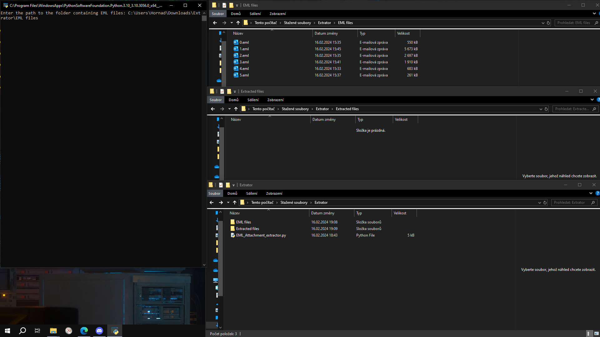
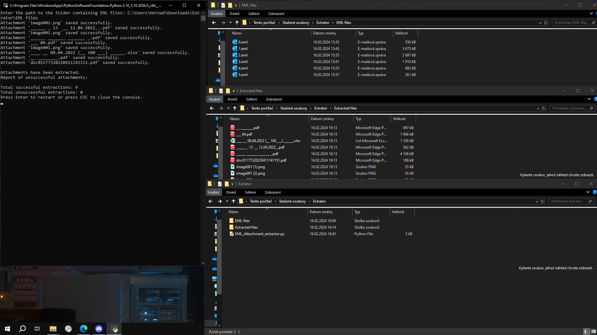

# EML Attachment Extractor

Extracts attachments from EML emails. This tool allows extract attachments from EML format emails into a specified output directory. 
Attachments are decoded and saved with appropriate filenames.

## Disclaimer

This code is provided "as is," and I cannot guarantee its flawlessness or whether it will cause any issues.

Use this code cautiously, and consider backing up important files before running it.

I am not responsible for data loss or any other inconveniences caused by this code.

---

## Installation and Usage

### Prerequisites

Make sure you have Python installed on your machine.

### Installation

1. Clone or download the repository to your local machine.

    ```bash
    pip install git+https://github.com/Hornad2005/EML-Attachment-Extractor.git
    ```

2. Open a terminal or command prompt.

3. Navigate to the project directory.

### Usage

1. Update the `output_folder` variable in the script (**line 99**) with the desired output directory. Change `"C:\Users\YOURNAME\Documents\EML\OUTPUT"` to your preferred output folder path.

    ```python
    output_folder = r"C:\Users\YOURNAME\Documents\EML\OUTPUT"  # Change the OUTPUT FOLDER here. <------------
    ```

2. Save the changes.

3. Run the script by executing:

    ```bash
    python EML_Attachment_extractor.py
    ```

### Note

- Use the Enter key to restart the extraction process or the ESC key to exit the console after completion.

---

## Screenshots




